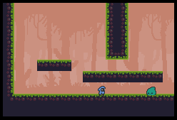

# Sidescroller test game
Playing around with pyglet.

## Built with
Python (Pyglet) 

## Installation
1. Clone repository.
2. From inside a virtual environment: pip install -r requirements.txt
3. Launch: python main.py

## Screenshots

## Art by
[o-lobster](https://o-lobster.itch.io/)

## Features
- Run around...

## Status
In progress.
